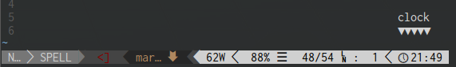

<h1 align="center">
    Vim Clock Tick
</h1>

Add a ticking clock face to [airline-clock](https://github.com/enricobacis/vim-airline-clock)



## Installing

Using pathogen, clone into `~/.vim/bundles/vim-clock-tick`

## Configuration

 * Changing the clock format

```
let g:airline#extensions#clock_tick#format = '%H:%M:%S'
```

 * The tick speed by default depends on the hour. To change it to minutes use `'M'` and seconds use `'S'`.

```
let g:airline#extensions#clock_tick#delta = 'S'
```
